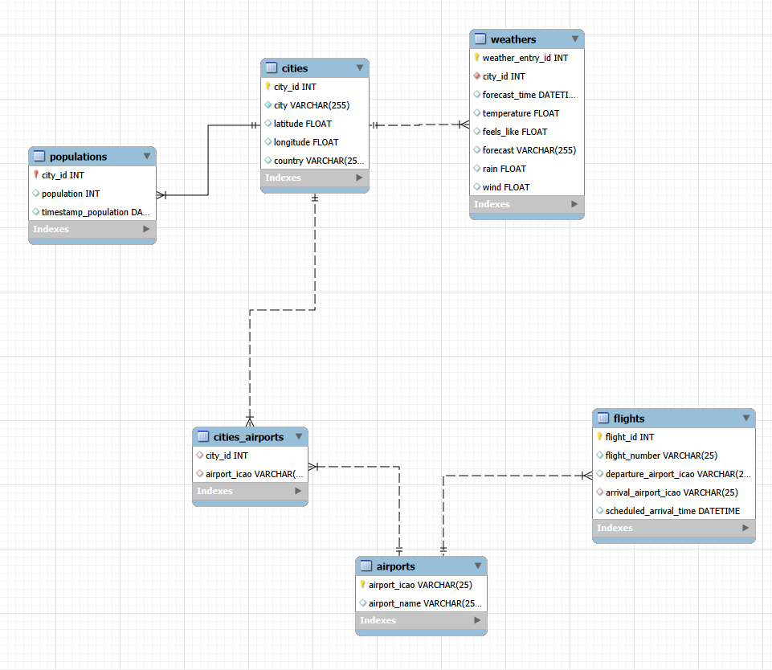

# City Data ETL Pipeline: Web Scraping, APIs & MySQL

> **Executive Summary:** Starting from just three city names, this project builds a full ETL pipeline that scrapes city and population data from Wikipedia, pulls weather and flight data from public APIs, and loads everything into a relational MySQL database. Every data source is wrapped in a reusable Python function, so the same pipeline can be pointed at new cities without rewriting any logic, turning a one-off data-gathering exercise into a small, reusable data acquisition system.

## Project Overview

This project builds a complete ETL (Extract, Transform, Load) pipeline for a fictional data acquisition case study for the company Gans. Starting with nothing but three city names (Berlin, Hamburg, Cologne), the pipeline collects city, population, weather, airport, and flight data from the web and public APIs, cleans and structures it in Python, and loads it into a relational MySQL database ready for analysis.

The goal wasn't just to gather data, but to design a data pipeline that is reusable and scalable, every data source is wrapped in a function that takes a list of cities (or coordinates, or airport codes) and can be called on new cities without rewriting the logic.

---

## Data Sources

- **City & population data:** scraped from Wikipedia infoboxes using BeautifulSoup (country, latitude, longitude, population)
- **Weather data:** OpenWeather's 5-day/3-hour forecast API
- **Airport data:** AeroDataBox API (RapidAPI), searched by location
- **Flight data:** AeroDataBox API, arrivals by airport ICAO code, for the next day

---

## Project Workflow

1. **Web Scraping (Cities & Population)** — extracted country, latitude, longitude, and population for each city from Wikipedia, first manually per city, then generalised into reusable functions.
2. **Python → SQL (Cities & Population)** — designed the MySQL schema and loaded the cleaned city and population DataFrames as the foundation tables.
3. **Weather API** — pulled 5-day forecasts per city from OpenWeather, parsed the nested JSON response into a flat DataFrame, and loaded it into a `weathers` table linked to `cities`.
4. **Airport API** — looked up nearby airports for each city by coordinates, and built a join table (`cities_airports`) connecting cities to their ICAO airport codes.
5. **Flight API** — retrieved next-day arrivals for each city's airport(s) by ICAO code and loaded them into a `flights` table.

All steps live in a single notebook: [`notebooks/ETL-Pipeline.ipynb`](notebooks/ETL-Pipeline.ipynb).

---

## Data Model

The database consists of 6 tables: `cities` as the central table, with `populations`, `weathers`, and `cities_airports` referencing it by `city_id`, and `airports` connected to both `cities_airports` and `flights` by ICAO code.



Full schema: [`sql/schema.sql`](sql/schema.sql)

---

## Challenges & Solutions

**Wikipedia's population field wasn't where expected.** The population number isn't a direct sibling of the "Population" label in the infobox, searching immediately after the label text returned the wrong element. Solved with `.find_next("td")` to search forward in the document until the actual data cell was found, then stripped the thousands-separator commas and cast the result to an integer.

**The flights API only returns 12 hours of data per call.** A full day of arrivals for one airport required two separate calls — `00:00–11:59` and `12:00–23:59`, handled inside the same function so the split is invisible to whoever calls it with just a list of ICAO codes.

**Matching airports back to cities wasn't guaranteed.** The airport search API returns every airport within a radius of a city's coordinates, not just the one for that city, searching near Cologne, for example, also returned Düsseldorf's airport. Merging the results against the known city list and dropping rows with no matching `city_id` filtered these out before loading into `cities_airports`.

**API keys needed to stay out of the notebook.** Both the OpenWeather and RapidAPI (AeroDataBox) keys are loaded from a local `.env` file via `python-dotenv`, rather than hardcoded, the notebook can be shared or published without exposing credentials.

---

## Technologies Used

- **Python**
  - `requests` – API calls
  - `BeautifulSoup` – web scraping
  - `pandas` – data structuring and cleaning
  - `python-dotenv` – secure API key management
  - `SQLAlchemy` / `PyMySQL` – connecting Python to MySQL
- **MySQL** – relational data warehouse
- **APIs:** OpenWeather (5-day forecast), AeroDataBox (airports & flights)

---

## Project Structure

```
├── README.md
├── notebooks/
│   └── ETL-Pipeline.ipynb      full pipeline: scraping, API calls, cleaning, SQL loading
└── sql/
    ├── schema.sql               database schema (CREATE TABLE statements)
    └── schema_diagram.png       entity-relationship diagram
```
